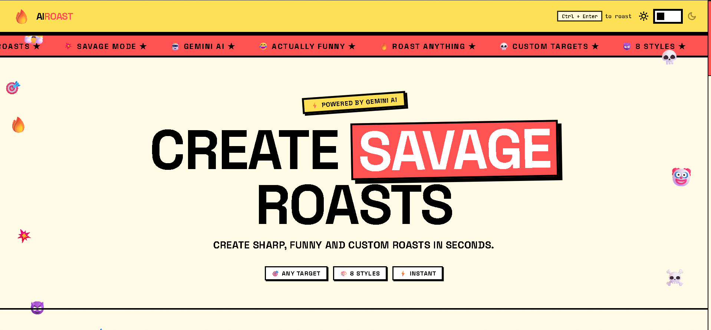

# AIROAST

* **Project Description:** AIROAST is a professional, high-performance, and visually striking AI Roast Maker application built with a bold Neobrutalism design system.
* **Main Purpose:** To generate savage, sarcastic, funny, and custom roasts of anything (roommates, startup founders, technologies, coding habits, or social media profiles) based on user instructions and customized style preferences, while completely protecting user API keys and server health.
* **Key Features:**
  * Custom target inputs with PG-13 filtering.
  * Multi-dimensional roast configuration (8 Comedy Styles, 4 Length Modes, 5 Spice Intensities).
  * Dynamic, server-enforced daily usage limits based on output length (Long: 1/day, Medium: 2/day, Short/One-Liner: 3/day).
  * Backend API proxy that hides the Gemini API key completely from the browser.
  * Multi-model health system with automatic failover and 5-minute cooldown tracking.
  * Output validation that automatically repairs/discards incomplete trailing sentences and regenerates on failure.
  * 24-hour server-side in-memory response cache to serve duplicate requests instantly.
  * Real-time persistent analytics dashboard backed by a local JSON file.
  * Interactive Neobrutalist UI with dark/light themes, typewriter animation, interactive history log with collapsible toggle, card download, and sharing capabilities.

# Screenshots / Preview



# Features

* **AI Roast Generator Input:** Form fields allowing users to input targets up to 500 characters, select from 9 categories, choose 8 comedy styles, toggle between 4 length options, and slide through 5 intensity levels.
* **Dynamic Daily Limits:** Keeps track of daily usage by client IP. In production, users are dynamically limited based on the length mode selected (1, 2, or 3 roasts max per day). In test mode, limits are automatically bypassed.
* **Real-time Live Stats Counters:** Displays cumulative counts for "Total Roasts", "Users Emo Damaged" (roasts with severity levels of Severe/Emotional Damage), "Avg Burn Temp" (based on random spice calculation), and "Today's Victims".
* **Collapsible Roast History:** Saves up to 20 past roasts to browser `localStorage` and lists them in an interactive feed. Displays only the 5 most recent items with a yellow Neobrutalist "Show More / Show Less" toggle button.
* **PNG Image Download:** Uses `html2canvas` to render and download the generated roast card directly as an image file.
* **Confetti Animations:** Triggers a celebration overlay using canvas-confetti whenever a user generates a roast scoring a severe or emotional damage rating (>= 75 score).
* **Automatic Failovers & Retries:** Backend automatically switches models when rate-limited or timed out, retrying once with an expanded token budget if the output is truncated.

# Tech Stack

### Frontend:
* **Framework:** React 19
* **Language:** TypeScript
* **Libraries:**
  * `framer-motion` (Fluid neobrutalist animations and transitions)
  * `html2canvas` (Image export functionality)
  * `canvas-confetti` (Scoring celebrations)
  * `lucide-react` (Vector outline iconography)

### Backend:
* **Runtime:** Node.js
* **Framework:** Express 5
* **Libraries:**
  * `cors` (Origin whitelist management)
  * `helmet` (Security headers protection)
  * `morgan` (HTTP request logging)
  * `express-rate-limit` (Bot and DDoS defense)
  * `dotenv` (Environment configurations loader)

### AI:
* **Gemini SDK:** `@google/generative-ai` (v0.24.0)
* **Supported Models:**
  1. `gemini-3.1-flash-lite` (Primary Model)
  2. `gemini-2.5-flash-lite` (Secondary Fallback)
  3. `gemini-2.5-flash` (High-Capacity Fallback)
  4. `gemini-3.5-flash` (Ultimate Fallback)

# Project Structure

```
neubrutalism-example/
├── server/
│   ├── .env                 # Server-side environment secrets (Git-ignored)
│   ├── .env.example         # Template for environment variables
│   ├── index.js             # Express application and failover router
│   └── stats.json           # Persistent server statistics storage
├── src/
│   ├── assets/              # App images and vector logo assets
│   ├── components/          # Neobrutalist styling components
│   │   ├── CategorySelector.tsx # Category selection chips
│   │   ├── FloatingDecos.tsx    # Neobrutalist background layout accents
│   │   ├── Footer.tsx           # Footer and theme toggle
│   │   ├── HeroSection.tsx      # Landing page headlines and text marquee
│   │   ├── Navbar.tsx           # Navigation banner with logo
│   │   ├── RoastHistory.tsx     # Local storage history and collapse button
│   │   ├── RoastInput.tsx      # Roast parameter controls and remaining counter
│   │   ├── RoastResult.tsx     # Output card with sharing/saving options
│   │   ├── StatsSection.tsx     # Real-time counter components
│   │   └── Toast.tsx           # Floating notifications component
│   ├── hooks/
│   │   └── useAnimations.ts  # Counters, typewriter effect, localStorage hooks
│   ├── services/
│   │   └── gemini.ts        # Client API service proxy requests
│   ├── App.css              # Custom layout properties
│   ├── App.tsx              # Main orchestrator state
│   ├── index.css            # Neobrutalism design system tokens and resets
│   └── main.tsx             # Application entry point
├── index.html               # Main HTML wrapper template
├── package.json             # Commands, dependencies, and build scripts
├── tsconfig.json            # Base compiler setup
├── tsconfig.app.json        # Frontend TypeScript setup
├── tsconfig.node.json       # Node environment TypeScript setup
├── vite.config.ts           # Development proxy server configuration
└── neobrutalism.md          # Design system specifications document
```

# Installation

1. **Clone the Repository:**
   ```bash
   git clone <repository_url>
   cd neubrutalism-example
   ```

2. **Install Dependencies:**
   Install both server and client dependencies from the root directory:
   ```bash
   npm install
   ```

3. **Configure Environment Variables:**
   Initialize your backend environment settings:
   ```bash
   cp server/.env.example server/.env
   ```

4. **Start the Backend and Frontend concurrently:**
   Run the development setup:
   ```bash
   npm run dev
   ```
   *The server runs on port `3001` and Vite runs on `5173`/`5174`, proxying `/api/*` endpoints to bypass CORS in development.*

# Environment Variables

The server loads configuration variables from `server/.env`. Below is the complete environment specification:

| Variable | Required | Description | Default / Example |
| :--- | :---: | :--- | :--- |
| `GEMINI_API_KEY` | **Yes** | API key generated inside Google AI Studio | `AIzaSy...` |
| `PORT` | **No** | Port where the backend Express app listens | `3001` |
| `NODE_ENV` | **No** | Environment mode of the Node process (`development`, `production`) | `development` |
| `ALLOWED_ORIGINS` | **No** | Comma-separated list of browser origins permitted to bypass CORS | `http://localhost:5173,http://localhost:5174` |
| `APP_MODE` | **No** | Application mode determining limit checks (`test`, `production`) | `test` |

# Gemini API Setup

The Gemini API key is loaded exclusively inside the backend server:

* **Target File:** `server/index.js`
* **Configuration File:** `server/.env`
* **Variable Name:** `GEMINI_API_KEY`

At server startup, the key is read using the `dotenv` package (via `config({ path: join(__dirname, '.env') })` on line 7) and bound to the SDK initialization:

```javascript
const GEMINI_API_KEY = process.env.GEMINI_API_KEY;
const genAI = new GoogleGenerativeAI(GEMINI_API_KEY);
```

### Steps to obtain a Gemini API key:

1. Visit [Google AI Studio](https://aistudio.google.com/) and sign in with your Google account.
2. Click the **Get API key** button in the left sidebar or top header.
3. Select **Create API Key**. You can bind it to a new Google Cloud project or use an existing one.
4. Copy the generated API key (it begins with `AIzaSy`).
5. Open your `server/.env` file and paste it:
   ```env
   GEMINI_API_KEY=your_copied_api_key_here
   ```
6. Restart the application process to apply changes.

# Running the Project

### Development Mode

Runs both the frontend Vite build compiler and the Node server watcher concurrently using the `concurrently` package:

```bash
npm run dev
```

* Under the hood, this runs:
  * Client: `vite` (proxied on `http://localhost:5173`)
  * Server: `node --watch server/index.js` (listening on `http://localhost:3001`)

### Production Mode

To run in production mode, compile the client code into optimized static files first, then launch the Express server:

1. **Build the production bundle:**
   ```bash
   npm run build
   ```
   *Runs `tsc -b && vite build` to typecheck and compile assets into the `dist/` directory.*

2. **Start the backend server:**
   ```bash
   npm run start
   ```
   *Runs `node server/index.js` which serves endpoints and executes business logic.*

# API Endpoints

All endpoints are prefix-grouped under `/api/*`:

### 1. `GET /api/health`
* **Purpose:** Evaluates server health status, current environment modes, active model, model health stats, in-memory cache size, stats counters, and server time.
* **Request Body:** None
* **Response Example:**
  ```json
  {
    "status": "ok",
    "env": "development",
    "appMode": "test",
    "activeModel": "gemini-3.1-flash-lite",
    "modelHealth": {
      "gemini-3.1-flash-lite": { "available": true, "failures": 0, "cooldownUntil": 0, "successfulRequests": 14 },
      "gemini-2.5-flash-lite": { "available": true, "failures": 0, "cooldownUntil": 0, "successfulRequests": 0 },
      "gemini-2.5-flash": { "available": true, "failures": 0, "cooldownUntil": 0, "successfulRequests": 0 },
      "gemini-3.5-flash": { "available": true, "failures": 0, "cooldownUntil": 0, "successfulRequests": 0 }
    },
    "cacheSize": 3,
    "stats": {
      "totalRoasts": 42199,
      "usersEmoDamaged": 39857,
      "avgBurnTemp": 4831,
      "todaysVictims": 227
    },
    "timestamp": "2026-06-17T19:57:00.000Z"
  }
  ```

### 2. `GET /api/stats`
* **Purpose:** Fetches current aggregate statistics for the dashboard sections.
* **Request Body:** None
* **Response Example:**
  ```json
  {
    "totalRoasts": 42199,
    "usersEmoDamaged": 39857,
    "avgBurnTemp": 4831,
    "todaysVictims": 227
  }
  ```

### 3. `GET /api/usage`
* **Purpose:** Returns the current count of roasts generated today by the client IP.
* **Request Body:** None
* **Response Example:**
  ```json
  {
    "count": 0,
    "appMode": "test"
  }
  ```

### 4. `POST /api/roast`
* **Purpose:** Generates a roast based on the user's setup config.
* **Request Body:**
  ```json
  {
    "input": "Startup founders pivoting 5 times in a year",
    "category": "Startup",
    "style": "Savage",
    "length": "short",
    "intensity": 4
  }
  ```
* **Response Example:**
  ```json
  {
    "roast": "You call it a 'pivot', but your investors call it a cry for help. Stop spinning in circles and calling it direction.",
    "score": 88,
    "damageLevel": 4,
    "damageLabel": "Emotional Damage",
    "remaining": Infinity,
    "count": 1,
    "stats": {
      "totalRoasts": 42200,
      "usersEmoDamaged": 39858,
      "avgBurnTemp": 4831,
      "todaysVictims": 228
    }
  }
  ```

# Security

AIROAST implements multiple defensive measures against exploitation and abuse:

* **Helmet Middleware:** Configures HTTP headers protecting against cross-site scripting (XSS), clickjacking, and MIME sniffing attacks.
* **CORS Whitelists:** Restricts browser connections specifically to client-side origins listed inside `ALLOWED_ORIGINS`.
* **Input Sanitization:** Strips HTML element tags (`<` and `>`) and removes prompt-engineering overrides like `[INST]` or `SYSTEM:` tags to prevent API prompt injections.
* **API Key Protection:** The Google Gemini API key resides exclusively on the backend server. The client browser only communicates with the Express backend proxy.
* **Express Rate Limiting:** Enforces a limit of 30 requests per 15 minutes per IP address (skipped in `test` mode).
* **Length Constraints:** Rejects request payloads containing inputs shorter than 3 characters or longer than 500 characters.

# AI Model System

* **Model Priority Chain:**
  1. `gemini-3.1-flash-lite`
  2. `gemini-2.5-flash-lite`
  3. `gemini-2.5-flash`
  4. `gemini-3.5-flash`
* **Failover & Cooldown Behavior:**
  When a model throws an API error, times out (after 15 seconds), or returns an un-parsable response structure, the server places it on a **5-minute cooldown** (`COOLDOWN_MS`). The backend immediately falls back to the next available model in the priority chain automatically, keeping model changes hidden from the frontend user.
* **Output Validation Logic:**
  Each response is validated using sentence boundaries parsing (`validateAndFormatRoast`):
  * **One-liner:** Exactly 1 complete sentence.
  * **Short:** 1–2 complete sentences.
  * **Medium:** 3–4 complete sentences (fails if less than 3 sentences).
  * **Long:** 5–8 complete sentences (fails if less than 5 sentences).
  Incomplete trailing sentences are discarded. If validation fails or the text is truncated (`MAX_TOKENS` finish reason), the server automatically retries **once with a higher token limit (up to 1000 tokens)** or **regenerates the request once**.

# Data Storage

* **`server/stats.json`:** A local persistent file storing total global usage counters. Updated and saved on each successful generation.
* **In-Memory Cache:** Stores generated roasts inside an Express server `Map` keyed by `input+category+style+length+intensity`. Cache entries expire after 24 hours. A cleanup loop sweeps expired cache items every hour.
* **Client LocalStorage:** Saves the local history list (`roastHistory` up to 20 items), client theme state (`darkMode`), and daily usage limits (`dailyUsage`).

# Troubleshooting

* **Fatal Crash: `GEMINI_API_KEY is not set`:**
  * **Cause:** The server did not load a key from `server/.env`.
  * **Fix:** Copy `server/.env.example` to `server/.env` and insert a valid Gemini API key. Make sure the file name is `.env` and it is located inside the `server/` directory.
* **Server Fails to Start:**
  * **Cause:** Port `3001` is already in use by another running service.
  * **Fix:** Change the `PORT` variable inside `server/.env` to another number (e.g., `PORT=3002`) and restart.
* **Frontend Cannot Reach Backend:**
  * **Cause:** Vite proxy port in `vite.config.ts` does not match the port of the Express server.
  * **Fix:** Verify the backend port in `server/.env` matches the target port defined in `vite.config.ts` (default: `http://localhost:3001`).
* **Roast Button is Disabled / "LIMIT REACHED":**
  * **Cause:** In production mode, you have reached your daily quota limit (Long: 1, Medium: 2, Short/One-Liner: 3 per day).
  * **Fix:** Set `APP_MODE=test` in your `server/.env` to disable all daily quotas for local testing.
* **Gemini API Failures (502 Bad Gateway):**
  * **Cause:** All fallback models timed out, returned invalid formats, or encountered quota restrictions.
  * **Fix:** Verify internet connectivity, check Google Cloud system health, or inspect your Gemini billing details inside Google AI Studio.

# License

License not specified.

# Contributing

1. **Fork** the repository on GitHub.
2. **Create a new branch** for your feature or bug fix:
   ```bash
   git checkout -b feature/your-feature-name
   ```
3. **Commit** your modifications with concise commit messages:
   ```bash
   git commit -m "Add feature details"
   ```
4. **Push** the commits to your remote fork:
   ```bash
   git push origin feature/your-feature-name
   ```
5. **Open a Pull Request** explaining the changes made.


