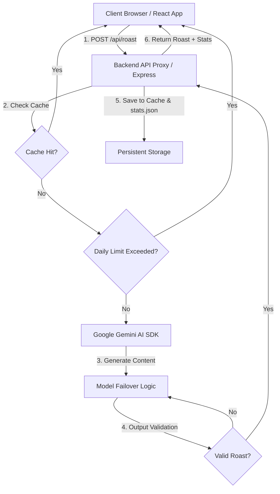

# Project Documentation — AIROAST (AI Roast Maker)

Welcome to the official technical documentation for **AIROAST**, a secure, high-performance, and visually striking AI Roast Maker. This document outlines how the project is built, how it handles security and data, how the AI failover works, and instructions for running it.

---

## 🏗 How It Works (System Architecture)

AIROAST is built as a split-architecture full-stack application separating user interaction from the AI intelligence layer:

1. **Frontend (Vite + React + TypeScript):** Handles the user interface, custom parameter selections (style, length, intensity), local roast history storage (`localStorage`), and neobrutalist styling.
2. **Backend (Node.js + Express):** Acts as a secure gateway that proxies all requests to Google's Gemini models, enforces rate limits, validates output quality, caches popular requests for 24 hours in-memory, and hosts the persistent statistics dashboard.

---

## 🤖 AI Models and Fallback Health System

To ensure high availability and prevent failures during peak traffic or rate-limiting events, the application implements a server-managed **automatic model priority chain**:

### Priority Order
1. **`gemini-3.1-flash-lite`** (Primary choice - fastest and cheapest)
2. **`gemini-2.5-flash-lite`** (Secondary fallback - high throughput)
3. **`gemini-2.5-flash`** (High capacity fallback)
4. **`gemini-3.5-flash`** (Ultimate fallback - high capability)

### Model Health Tracking
The server continuously tracks the performance of each model:
* **`failures`**: Monitored count of consecutive request failures (timeouts, rate limits, or invalid outputs).
* **`cooldownUntil`**: If a model fails once, it is marked unhealthy and goes on a **5-minute cooldown** (unavailable).
* **`successfulRequests`**: Monitored count of successful completions.

If a model times out (15-second cutoff), hits rate limits, or generates incomplete/invalid output, it is immediately skipped, and the backend attempts the generation using the next available model in the priority chain.

---

## 📦 Libraries and Technologies Used

### Frontend (Client-side)
* **Vite:** High-performance local development server and bundler.
* **React & TypeScript:** Core component framework providing type safety and robust state management.
* **Framer Motion:** Powering the neobrutalist animations, smooth card entrances, and typewriter effects.
* **html2canvas:** Allows users to download a styled copy of their roast card as a PNG.
* **canvas-confetti:** Fires confetti celebrations when severe/emotional damage levels are triggered.
* **Lucide React:** Custom stroke-based icons aligned with the neobrutalist outlines.

### Backend (Server-side)
* **Express:** Minimal web framework handling incoming requests.
* **@google/generative-ai:** Official SDK to interact with Google Gemini models.
* **Helmet:** Automatically sets secure HTTP headers to prevent sniffing and cross-site scripting (XSS).
* **Cors:** Middleware restricting API access to permitted client origins.
* **Morgan:** Developer request logging.
* **Express Rate Limit:** Protection middleware against broad IP spam.

---

## 🎨 Design System: Neobrutalism

AIROAST is styled using **Neobrutalism** (Neo-Brutalism), characterized by loud colors, high contrast, and flat geometry:

* **Borders:** Thick black outlines (`border: 3px solid #000000` or `4px solid #000000`) serve as structural dividers.
* **Shadows:** Hard, solid flat offset drop-shadows (`box-shadow: 6px 6px 0px #000000`) instead of blurry realistic shadows. Shadows translate on hover/active states to give components a physical, click-responsive feel.
* **Harmonious Palette:** Vibrant contrasts using electric yellow (`#ffe156`), primary red (`#ff5252`), green (`#42e695`), and warm cream (`#fffbe6`) as background variables.
* **Typography:** Bold `Space Grotesk` headers (900-weight) and mono-spaced `JetBrains Mono` text blocks.

---

## 🔒 Security Hardening

### 1. API Token Protection
* **Complete Isolation:** The Gemini API key is stored strictly inside `server/.env` on the server.
* **Zero Client Exposure:** The client browser never sees the API token. DevTools Network inspections will only show calls directed to `/api/roast` with no secrets exposed.
* **Git Protection:** Env configuration files are explicitly ignored in `.gitignore`.

### 2. Request Sanitization and Hacking Defense
* **Input Scrubbing:** Inputs are sanitized to remove HTML tags, script injection patterns, and prompt engineering overrides (e.g. stripping `[INST]` or `SYSTEM:` strings).
* **Express Rate Limiting:** Restricts IPs to a maximum of 30 requests per 15 minutes to prevent DDoS or bot attacks.
* **Helmet Middleware:** Enforces clickjacking protection, blocks MIME type sniffing, and forces secure transport headers.
* **CORS Restrictions:** Rejects requests coming from unauthorized domains.

---

## 💾 Stored Data Profile

AIROAST is designed with a lightweight data footprint:

1. **`server/stats.json` (Persistent Server Data):** 
   - Tracks global cumulative stats: `totalRoasts`, `usersEmoDamaged`, `avgBurnTemp`, `todaysVictims`, and `lastResetDate`.
   - Seeded with historical statistics to maintain visual realism.
2. **IP Usage Map (In-Memory Server Data):**
   - Stores mapping keys (`ip:YYYY-MM-DD` -> `count`) to enforce daily request quotas.
3. **Response Cache (In-Memory Server Data):**
   - Caches generated roast payloads for 24 hours using the compound key `input+category+style+length+intensity` to save API quota and speed up duplicate requests.
4. **Roast History (Client-side Data):**
   - Saved locally in the user's browser `localStorage` under `roastHistory`.

---

## ⏳ Usage Limits and Midnight Resets

### Dynamic Quotas
To prevent abuse, daily limits are applied dynamically based on the resource intensity of the requested roast length:
* **Long:** Max **1 roast per day**
* **Medium:** Max **2 roasts per day**
* **Short & One-Liner:** Max **3 roasts per day**

### How Limit Expiry is Handled
1. **Server Rejection:** If `APP_MODE` is set to `production` and a client IP requests a roast that exceeds the length limit, the backend blocks the request and returns a `429 Too Many Requests` status.
2. **Frontend Interlocking:** The client disables the generate button and shows `🚫 LIMIT REACHED` or the remaining count.

### Is the 24h/Midnight Reset Working Correctly?
**Yes, it works correctly.**
- The reset is tied to the UTC calendar date string (`YYYY-MM-DD`). 
- When the date rolls over, the server maps the user's IP to a fresh key (e.g. `ip:2026-06-18`), instantly restoring their daily quota to full capacity.
- Additionally, a background garbage collection loop runs every hour on the server to purge old memory keys from previous days, preventing memory leaks.
- This ensures users are restricted correctly during their local day and can use the site again after midnight.

---

